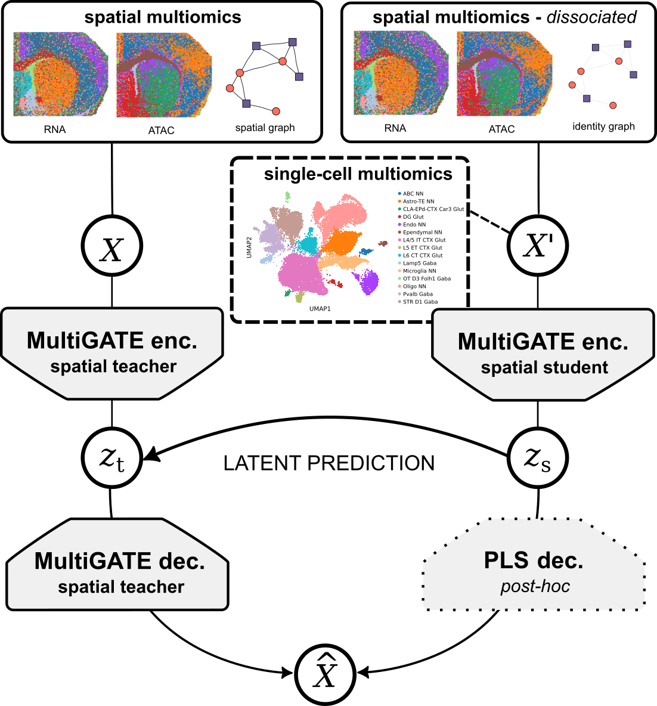

# SpatialJEPA

`SpatialJEPA` is a JEPA-inspired framework for transferring spatial context from spatial multiomics data to dissociated single-cell multiome data. It uses a MultiGATE-based spatial teacher trained with the full neighborhood graph and distills its latent representation into a student trained with a self-only graph, allowing the student to operate when spatial coordinates are unavailable.

In mouse brain RNA-ATAC experiments, SpatialJEPA supports source-to-target alignment, recovers spatially organized transcriptomic and chromatin-accessibility programs, and produces representations concordant with ligand--receptor pathway structure.

## Citation

If you use `SpatialJEPA`, please cite the accepted CIBB 2026 short paper:

> Mann-Krzisnik, Dylan and Li, Yue. “SpatialJEPA: JEPA-inspired graph-context distillation for spatially aware multiomics integration.” Accepted short paper and oral presentation, *21st International Conference on Computational Intelligence Methods for Bioinformatics and Biostatistics (CIBB 2026)*, Rome, Italy, September 2–4, 2026.

`SpatialJEPA` builds on the repo for MultiGATE spatial multiomics framework. Please cite the original MultiGATE work where appropriate:

> Miao, Jishuai, Jinzhao Li, Jingxue Xin, Jiajuan Tu, Muyang Ge, Ji Qi, Xiaocheng Zhou, Ying Zhu, Can Yang, and Zhixiang Lin. "MultiGATE: integrative analysis and regulatory inference in spatial multi-omics data via graph representation learning." *Nature Communications* 16, no. 1 (2025): 9403. https://www.nature.com/articles/s41467-025-63418-x